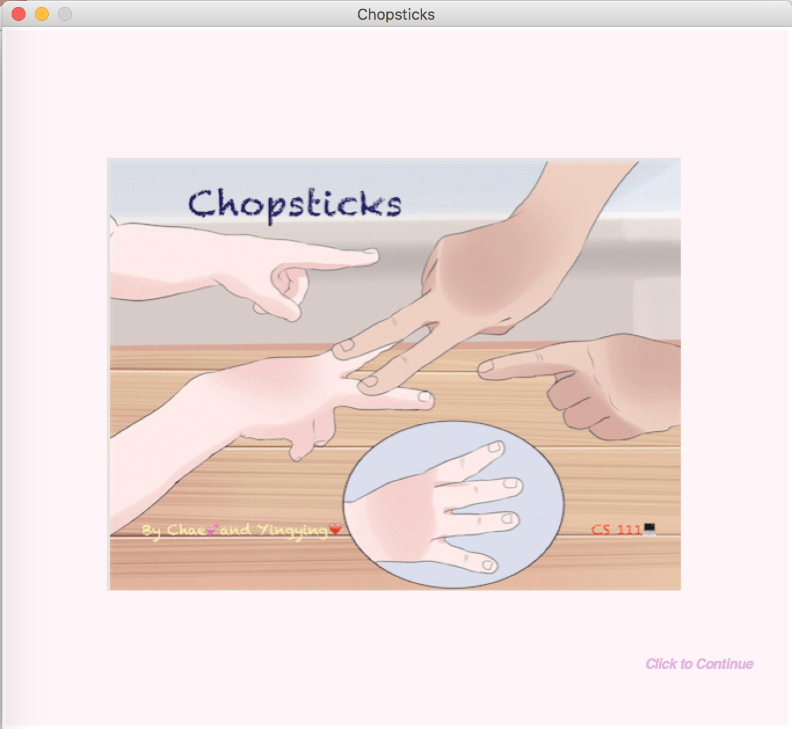
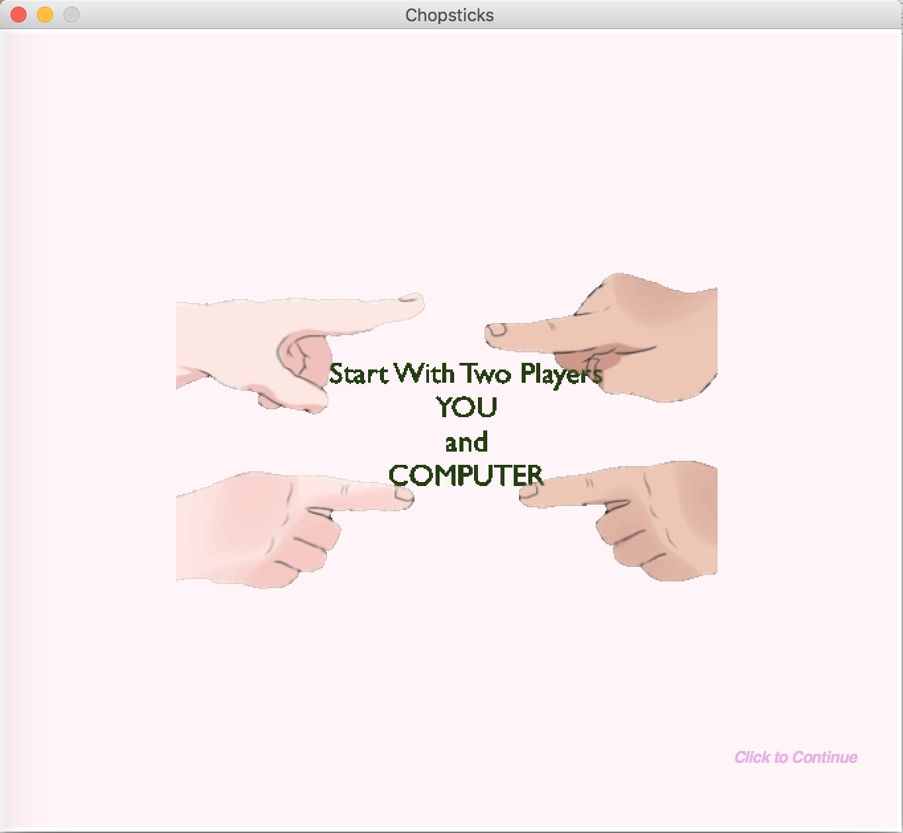
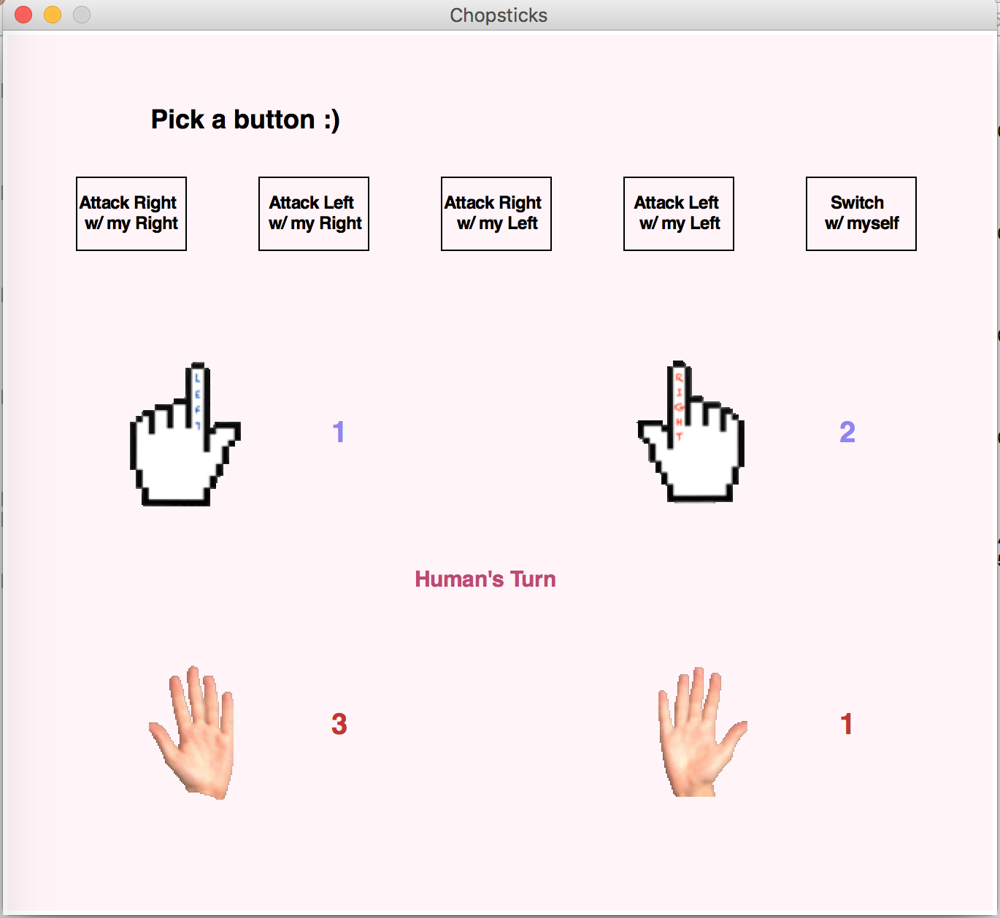
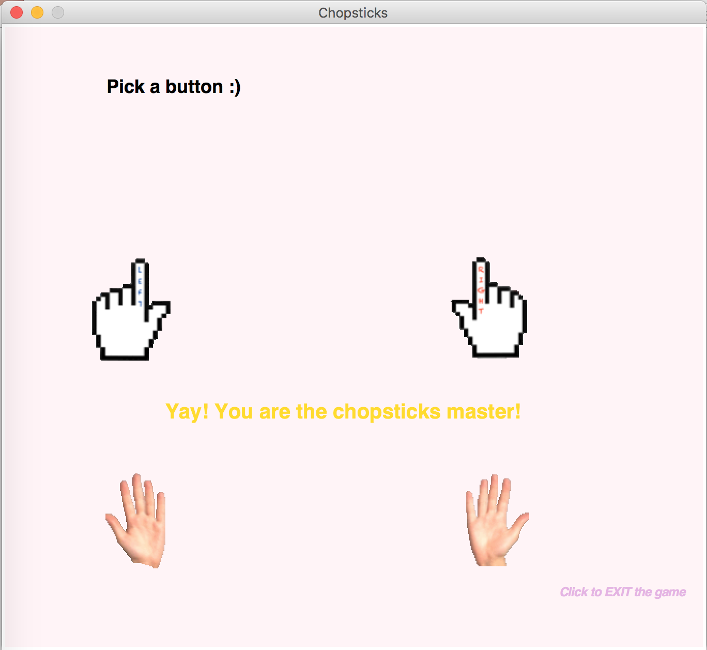

# Chopstick-game
Intro to Computer Science final project. Winter • 2017. 

## Run this game

To run the program, please clone this repository and change domain into the folder with all the pictures and the graphics module present.  Then, call chopsticks.py through command prompt $python3 chopsticks.py. 

Click through the instructions to start the game.  
Click the buttons to make your moves.  
Follow the rules and see if you are the chopsticks master!!  
You may also reference the command line to track the history of the game.

## Game rules
Python Program allows a single player to play chopsticks against the computer.
The human player gets to start off the game, and the basic rules apply. If player 1 attacks a hand of player 2, the hand which has been attacked must now add the number of fingers on player 1 attacking hand to the number of fingers player 2 had on his or her attacked hand.  if the number of fingers that add up on one hand equals or exceeds 5, that hand is out.  You cannot use a hand that is out, but one may revive their hand by dividing up the number of fingers on one hand, and sharing with the other hand.  One loses if both his or her hands become out.
The program, as of now, provides buttons for the players to click on to choose their attacks

## Classes in this program
Our program is made up of 3 classes & one class(hand) creates instances of different pairs of hands, i.e. one instance will give one player; the second class(game_g) is responsible for the graphics used in the game, which for now is just creating, recognizing, and deleting buttons at the appropriate time; and lastly the 3rd class (A_chopsticks) actually plays the game, as in it has the function responsible for our computer intelligence and a play function that puts most of the rules of the game in place.  Our main function basically creates two instances of hand, p1 for human player and p2 for computer.  It calls our graphics class and starts the game!

Current our program is in great shape.  We could no longer find bugs.  The buttons all get recognized, the information printed on both the command line and the windows are correct.  The switch function does not allow for cheating.  Everything should be working fine

## Computer rules (AI - implementation): 
*Always interprets the right hand first*
* First choice: of action is to divide up the fingers if one of the hands have been declared ÒoutÓ
* This is for survival!!
* Second choice: If right hand has fingers, attack whichever playerÕs hand has fingers
* Third choice: if left hand has fingers, attack whichever playerÕs hand has fingers.

## Specific rules for player to follow:
* Cannot switch without changing the situation of the game.  An example being if one person has 4 fingers on the right hand and no fingers on the left, he or she cannot switch so that the right now has 0 fingers and the left has 4.
* Cannot attack another personÕs zero, and cannot attack with a hand of zero.
* It is possible for one to get their own two hands out of the game through reckless switching

## Author: 
* **Yingying Wang** 
* **Chae Kim** 

## Screenshots of the game

